# Product Requirements Document — InternTrack

## 00. Document Control

| Field | Value |
|---|---|
| Dokumen | PRD — InternTrack: Dashboard Monitoring PKL & Magang Siswa |
| Versi | 1.0 |
| Tanggal | 21 Juli 2026 |
| Disusun oleh | Claude (PRD Architect) berdasarkan brief & referensi desain stakeholder |
| Status | Draft — menunggu review stakeholder |

### Change Log

| Versi | Tanggal | Perubahan | Penulis |
|---|---|---|---|
| 1.0 | 2026-07-21 | Draft awal berdasarkan discovery + referensi visual (7 gambar dashboard) + Design System Analysis Apple | Claude |

---

## 01. Executive Summary

**InternTrack** adalah dashboard web untuk memonitor proses Praktik Kerja Lapangan (PKL) dan Magang siswa SMK/SMA di satu sekolah, mulai dari penempatan siswa ke Dunia Usaha/Dunia Industri (DUDI), absensi kehadiran berbasis QR Code di lokasi kerja, pengisian jurnal kegiatan harian, penilaian oleh guru pembimbing sekolah maupun pembimbing industri, hingga penerbitan laporan akhir dan sertifikat PKL.

**Tujuan bisnis:** menggantikan proses pemantauan PKL yang saat ini manual (kertas, WhatsApp, spreadsheet terpisah) dengan satu sistem terpusat yang memberi visibilitas real-time kepada koordinator PKL dan guru pembimbing, mempercepat proses penilaian, dan menghasilkan dokumen akhir (laporan & sertifikat) secara otomatis.

**Target rilis:** MVP dalam ~10 minggu (**ASSUMPTION**, lihat §14 Roadmap).

**Key stakeholders:**

| Stakeholder | Kepentingan |
|---|---|
| Waka Humas / Koordinator PKL (Admin) | Kontrol penuh proses penempatan, laporan ke kepala sekolah |
| Guru Pembimbing | Memantau & menilai siswa bimbingannya |
| Pembimbing Industri (DUDI) | Menilai & memberi feedback siswa di lokasi kerja |
| Siswa | Menjalani PKL, mengisi jurnal, absen |
| Kepala Sekolah | Melihat ringkasan capaian PKL sekolah |

---

## 02. Business Background

### Problem Statement
Proses monitoring PKL di sekolah pada umumnya berjalan manual: siswa melapor kehadiran lewat WhatsApp/buku, guru pembimbing mengunjungi lokasi secara berkala untuk memantau, penilaian direkap manual dari lembar kertas yang dibawa pulang siswa, dan laporan akhir/sertifikat dibuat satu per satu di akhir periode. **ASSUMPTION** — pain point ini diasumsikan berlaku karena tidak ada sistem existing yang disebutkan stakeholder.

### Current-State Pain Points
- Koordinator PKL tidak punya visibilitas real-time siapa yang aktif, siapa yang bermasalah (tidak hadir, jurnal kosong).
- Guru pembimbing sulit memvalidasi kehadiran siswa di lokasi tanpa kunjungan fisik.
- Penilaian dari DUDI sering terlambat/hilang karena bergantung pada dokumen fisik.
- Rekap akhir (laporan, sertifikat) memakan waktu manual yang signifikan menjelang akhir periode PKL.

### Why Now
Sekolah memerlukan proses PKL yang lebih akuntabel dan terdokumentasi, terutama karena PKL menjadi komponen wajib kurikulum SMK yang dinilai dan diaudit. **ASSUMPTION.**

### Konteks Kompetitif
Di luar sekolah, ada aplikasi presensi umum (misal aplikasi absensi karyawan) tapi tidak dirancang untuk alur PKL sekolah (penempatan siswa-DUDI-guru, jurnal harian, penilaian dua pihak, sertifikasi). InternTrack fokus spesifik pada domain ini. **ASSUMPTION** — tidak ada riset kompetitor formal dilakukan; ini observasi umum domain.

---

## 03. Product

### Vision Statement
Menjadi satu sumber kebenaran (single source of truth) untuk seluruh siklus PKL siswa — dari penempatan sampai sertifikasi — sehingga koordinator, guru, DUDI, dan siswa punya visibilitas yang sama atas progres PKL kapan saja.

### Goals

| Goal | Terhubung ke metrik sukses |
|---|---|
| Digitalisasi absensi PKL | % kehadiran tercatat otomatis via QR vs manual |
| Sentralisasi jurnal & penilaian | % siswa dengan jurnal harian terisi lengkap |
| Percepatan laporan akhir | Waktu rata-rata pembuatan laporan akhir per siswa |
| Visibilitas real-time bagi koordinator/guru | Waktu deteksi siswa "bermasalah" (tidak hadir/jurnal kosong) |

### Scope

**In-scope (MVP):**
- Manajemen data master: siswa, kelas/jurusan, DUDI, periode PKL, guru pembimbing, pembimbing industri
- Penempatan siswa ke DUDI + pembimbing (sekolah & industri)
- Generate & kelola QR Code per DUDI, absensi masuk/pulang via scan QR
- Jurnal kegiatan harian siswa + review/komentar guru & pembimbing industri
- Penilaian oleh guru pembimbing sekolah dan pembimbing industri (multi-aspek/kompetensi)
- Laporan akhir PKL per siswa (PDF) & sertifikat PKL
- Dashboard kanban-style (mengikuti referensi visual): kolom tahapan PKL, avatar stack siswa/pembimbing, statistik donut chart, tabel ringkasan
- Notifikasi in-app & email (jurnal belum diisi, absensi anomali, penilaian jatuh tempo)
- Audit log aktivitas
- Pengaturan sekolah (profil sekolah, tahun ajaran, kategori penilaian, template sertifikat)

**Out-of-scope (MVP) — eksplisit tidak dikerjakan dulu:**
- Aplikasi mobile native (Android/iOS) — akses tetap lewat browser mobile-responsive
- Integrasi Dapodik / sistem informasi sekolah lain
- Integrasi WhatsApp Business API untuk notifikasi
- Mode offline / PWA offline-first
- Multi-sekolah / multi-tenant SaaS
- Dark mode
- Analitik prediktif/AI (misal deteksi otomatis siswa berisiko drop-out PKL)

### Success Metrics
- ≥ 90% siswa aktif memiliki minimal 1 entri jurnal harian per hari kerja dalam 2 minggu pertama peluncuran
- ≥ 95% absensi tercatat via QR (bukan input manual oleh admin)
- Waktu pembuatan laporan akhir per siswa turun dari (asumsi) ±30 menit manual menjadi < 2 menit (generate otomatis + review)
- Adopsi guru pembimbing: 100% guru pembimbing login & melakukan minimal 1 aksi (review jurnal/nilai) per minggu

**ASSUMPTION** — angka target di atas adalah baseline wajar untuk sistem sejenis; sebaiknya dikonfirmasi ulang oleh koordinator PKL setelah 1 periode berjalan.

### MVP Definition
Semua item di **In-scope** di atas, untuk 1 sekolah, 1 tahun ajaran aktif, akses web-only responsive.

### Roadmap Beyond MVP (ringkas — detail di §14)
Fase 2: integrasi WhatsApp, integrasi Dapodik, PWA offline, dark mode. Fase 3: aplikasi mobile native, multi-sekolah/SaaS, analitik lanjutan.

---

## 04. Requirements

### Functional Requirements

> Format: `FR-XXX` — Deskripsi — **Modul**

| ID | Deskripsi | Modul |
|---|---|---|
| FR-001 | Sistem menyediakan login berbasis NISN+password untuk siswa dan email+password untuk role lain | Auth |
| FR-002 | Sistem mendukung reset password via email (link token, expired 1 jam) | Auth |
| FR-003 | Admin dapat CRUD data siswa (NISN, nama, kelas, kontak orang tua, foto) | Master Data |
| FR-004 | Admin dapat CRUD data kelas & jurusan | Master Data |
| FR-005 | Admin dapat CRUD data DUDI (nama, alamat, koordinat lokasi, kontak, kuota siswa) | Master Data |
| FR-006 | Admin dapat CRUD data periode/tahun ajaran PKL dan menetapkan periode aktif | Master Data |
| FR-007 | Admin dapat mengundang (invite) akun Guru Pembimbing dan Pembimbing Industri via email | Master Data |
| FR-008 | Admin dapat membuat penempatan PKL: memasangkan siswa — DUDI — guru pembimbing — pembimbing industri — periode | Penempatan |
| FR-009 | Sistem mencegah 1 siswa punya lebih dari 1 penempatan aktif dalam periode yang sama | Penempatan |
| FR-010 | Admin dapat mengubah status penempatan (menunggu, aktif, selesai, dibatalkan) | Penempatan |
| FR-011 | Sistem generate QR Code unik per DUDI (dapat diregenerasi manual oleh Admin) | Absensi |
| FR-012 | Siswa dapat scan QR (kamera browser) untuk absen masuk dan pulang, hanya valid jika siswa punya penempatan aktif di DUDI tsb | Absensi |
| FR-013 | Sistem mencatat timestamp, tipe (masuk/pulang), dan menandai status "anomali" jika di luar jam kerja wajar atau scan ganda | Absensi |
| FR-014 | Guru pembimbing/Admin dapat melakukan koreksi manual absensi dengan catatan alasan (audit-logged) | Absensi |
| FR-015 | Siswa dapat mengisi jurnal kegiatan harian (deskripsi aktivitas, jam kerja, foto bukti) | Jurnal |
| FR-016 | Sistem mencegah pengisian jurnal untuk tanggal di masa depan atau lebih dari N hari ke belakang (**ASSUMPTION** N=3) | Jurnal |
| FR-017 | Guru pembimbing dan pembimbing industri dapat memberi komentar/status review pada tiap entri jurnal | Jurnal |
| FR-018 | Admin dapat mengatur kategori/aspek penilaian (nama, bobot, skala nilai, siapa penilai — sekolah/industri/keduanya) | Penilaian |
| FR-019 | Guru pembimbing dan pembimbing industri dapat menginput nilai per kategori untuk siswa bimbingannya | Penilaian |
| FR-020 | Sistem menghitung nilai akhir gabungan berdasarkan bobot kategori | Penilaian |
| FR-021 | Sistem generate laporan akhir PKL (PDF) berisi ringkasan jurnal, nilai, dan kehadiran per siswa | Laporan |
| FR-022 | Admin dapat menerbitkan sertifikat PKL (PDF bernomor unik) untuk siswa yang telah menyelesaikan seluruh penilaian | Laporan |
| FR-023 | Dashboard menampilkan tampilan kanban tahapan PKL (Pendaftaran/Pembekalan, Pelaksanaan, Penilaian, Selesai) dengan kartu berisi ringkasan aktivitas per tahap, mengikuti referensi visual | Dashboard |
| FR-024 | Dashboard menampilkan avatar stack siswa/pembimbing yang butuh perhatian (jurnal kosong > 2 hari, absensi anomali) dengan badge jumlah | Dashboard |
| FR-025 | Dashboard menampilkan statistik ringkas (donut chart) jumlah siswa Aktif vs Selesai vs Bermasalah | Dashboard |
| FR-026 | Dashboard menyediakan tabel data terbaru (penempatan/jurnal/absensi) dengan filter dan pencarian | Dashboard |
| FR-027 | Kepala Sekolah memiliki akses dashboard read-only tanpa aksi CRUD | Dashboard |
| FR-028 | Sistem mengirim notifikasi in-app + email ke siswa jika jurnal belum diisi H+1 | Notifikasi |
| FR-029 | Sistem mengirim notifikasi ke guru pembimbing jika ada absensi anomali pada siswa bimbingannya | Notifikasi |
| FR-030 | Sistem mengirim notifikasi ke pembimbing (sekolah & industri) saat mendekati tenggat penilaian akhir periode | Notifikasi |
| FR-031 | Sistem mencatat audit log untuk aksi sensitif: login, perubahan data siswa, koreksi absensi, penerbitan sertifikat | Audit Log |
| FR-032 | Admin dapat mengatur profil sekolah (nama, NPSN, logo, alamat) | Pengaturan |
| FR-033 | Admin dapat mengelola template sertifikat (teks, logo, tanda tangan digital) | Pengaturan |
| FR-034 | Sistem mendukung export data (siswa, penempatan, absensi, nilai) ke Excel | Laporan |
| FR-035 | Sistem menampilkan lokasi DUDI pada peta (Google Maps) di halaman detail DUDI | Master Data |

### Non-Functional Requirements

| ID | Deskripsi | Target Terukur |
|---|---|---|
| NFR-001 | Waktu muat halaman dashboard utama | < 2.5 detik pada koneksi 4G rata-rata |
| NFR-002 | Waktu respons API untuk operasi CRUD standar | p95 < 500ms |
| NFR-003 | Ketersediaan sistem | ≥ 99.5% uptime bulanan |
| NFR-004 | Kapasitas pengguna bersamaan | ≥ 100 concurrent users tanpa degradasi signifikan |
| NFR-005 | Skala data | Mendukung hingga 1.000 siswa & 5.000 entri jurnal/absensi per periode tanpa penurunan performa |
| NFR-006 | Kompatibilitas browser | 2 versi terbaru Chrome, Safari, Edge, Firefox (desktop & mobile) |
| NFR-007 | Aksesibilitas | Kontras warna memenuhi WCAG AA, target sentuh minimum 44×44px (mengikuti DSA Apple) |
| NFR-008 | Lokalisasi | Bahasa Indonesia saja untuk MVP, timezone tetap Asia/Jakarta (WIB) |
| NFR-009 | Keamanan data pribadi | Field data pribadi sensitif (kontak orang tua, alamat, foto) dienkripsi at-rest; kepatuhan prinsip UU PDP (minimalisasi data, consent) |
| NFR-010 | Backup & recovery | Backup harian otomatis, retensi 30 hari, RPO 24 jam, RTO 4 jam |
| NFR-011 | Audit trail | Log aksi sensitif disimpan minimal 1 tahun |
| NFR-012 | Rate limiting | Endpoint login & reset password dibatasi 5 percobaan/15 menit per akun/IP |
| NFR-013 | Skalabilitas | Arsitektur modular monolith yang dapat dipecah jadi service terpisah tanpa migrasi database besar-besaran |
| NFR-014 | Ukuran unggahan foto | Maks 5MB per foto, otomatis dikompresi ke maks 1200px sisi terpanjang |
| NFR-015 | Ketahanan koneksi lambat | Form jurnal/absensi menyimpan draft lokal sementara agar input tidak hilang saat submit gagal jaringan (bukan full offline-first) |

### Business Rules

- **BR-01**: Siswa hanya dapat memiliki satu penempatan PKL **aktif** dalam satu periode.
- **BR-02**: QR Code absensi hanya valid selama status penempatan siswa = `aktif` dan tanggal berada dalam rentang `start_date`–`end_date` penempatan.
- **BR-03**: Absensi "masuk" tanpa "pulang" di hari yang sama otomatis ditandai `anomali` setelah jam 23:59 hari itu dan memicu notifikasi ke guru pembimbing.
- **BR-04**: Nilai akhir hanya dapat dihitung jika seluruh kategori penilaian wajib (baik dari guru maupun industri) telah diisi.
- **BR-05**: Sertifikat hanya dapat diterbitkan jika status penempatan = `selesai` **dan** nilai akhir sudah terhitung.
- **BR-06**: Jurnal harian tidak dapat diisi untuk tanggal sebelum `start_date` atau setelah `end_date` penempatan.
- **BR-07**: Hanya Admin/Koordinator PKL yang dapat melakukan override/koreksi manual pada data absensi, dan setiap koreksi wajib disertai catatan alasan.
- **BR-08**: Regenerasi QR Code DUDI otomatis menonaktifkan QR versi sebelumnya (versi lama tidak lagi valid untuk scan baru).

### Acceptance Criteria (representatif — Given/When/Then)

**FR-012 — Scan QR Absensi**
- *Given* siswa memiliki penempatan aktif di DUDI X dan berada dalam rentang tanggal penempatan
- *When* siswa scan QR Code sah milik DUDI X melalui kamera browser
- *Then* sistem mencatat absensi `masuk`/`pulang` sesuai waktu scan dan menampilkan konfirmasi sukses

- *Given* siswa scan QR Code milik DUDI lain (bukan tempat penempatannya)
- *When* proses scan selesai
- *Then* sistem menolak dengan pesan error yang jelas dan **tidak** mencatat absensi

**FR-015 — Isi Jurnal Harian**
- *Given* siswa memiliki penempatan aktif
- *When* siswa mengisi jurnal untuk tanggal hari ini dengan deskripsi aktivitas
- *Then* entri tersimpan berstatus `submitted` dan dapat dilihat oleh guru pembimbing & pembimbing industri

- *Given* siswa mencoba mengisi jurnal untuk tanggal 5 hari yang lalu (melebihi batas N=3 hari)
- *When* siswa submit
- *Then* sistem menolak dengan validasi 422 dan pesan "tanggal jurnal di luar batas yang diizinkan"

**FR-020 — Hitung Nilai Akhir**
- *Given* seluruh kategori penilaian wajib untuk siswa telah diisi oleh guru dan pembimbing industri
- *When* sistem menghitung nilai akhir
- *Then* nilai akhir tersimpan sebagai rata-rata tertimbang sesuai bobot kategori dan tersedia untuk laporan akhir

- *Given* masih ada kategori penilaian wajib yang kosong
- *When* Admin mencoba generate laporan akhir
- *Then* sistem menampilkan status "Penilaian belum lengkap" dan menolak generate laporan final

**FR-022 — Terbitkan Sertifikat**
- *Given* penempatan berstatus `selesai` dan nilai akhir sudah terhitung
- *When* Admin menekan "Terbitkan Sertifikat"
- *Then* sistem membuat sertifikat PDF bernomor unik dan mencatatnya di audit log

- *Given* penempatan belum berstatus `selesai`
- *When* Admin mencoba menerbitkan sertifikat
- *Then* sistem menolak dan menampilkan syarat yang belum terpenuhi

*(Acceptance criteria untuk FR-001 s.d. FR-035 selengkapnya mengikuti pola Given/When/Then di atas; representatif ditampilkan untuk flow paling kritis sesuai catatan Quality Check §Step 5.)*

### User Stories

- Sebagai **Admin/Koordinator PKL**, saya ingin membuat penempatan siswa ke DUDI, supaya proses PKL punya catatan resmi siapa ditempatkan di mana.
- Sebagai **Admin/Koordinator PKL**, saya ingin melihat dashboard ringkasan status semua siswa, supaya saya bisa cepat tahu siapa yang bermasalah.
- Sebagai **Guru Pembimbing**, saya ingin melihat jurnal harian siswa bimbingan saya, supaya saya bisa memantau tanpa harus kunjungan fisik setiap hari.
- Sebagai **Guru Pembimbing**, saya ingin menginput nilai per kategori kompetensi, supaya penilaian akhir siswa terdokumentasi rapi.
- Sebagai **Pembimbing Industri**, saya ingin memberi komentar singkat pada jurnal siswa, supaya siswa dapat feedback real-time.
- Sebagai **Siswa**, saya ingin scan QR untuk absen, supaya saya tidak perlu absen manual/kertas.
- Sebagai **Siswa**, saya ingin mengisi jurnal harian dari HP saya, supaya saya bisa isi langsung di lokasi kerja.
- Sebagai **Kepala Sekolah**, saya ingin melihat ringkasan capaian PKL seluruh siswa, supaya saya punya gambaran menyeluruh tanpa perlu masuk detail operasional.
- Sebagai **Admin**, saya ingin sistem otomatis generate sertifikat PDF, supaya saya tidak perlu membuat manual satu per satu di akhir periode.

### Use Cases

**UC-01: Scan QR Absensi**
- **Aktor:** Siswa
- **Prasyarat:** Siswa login, memiliki penempatan aktif
- **Alur utama:** Siswa buka halaman "Absensi" → aktifkan kamera → arahkan ke QR di lokasi DUDI → sistem validasi token & kecocokan penempatan → catat timestamp → tampilkan konfirmasi
- **Alur alternatif:** QR tidak dikenali/expired → tampilkan error, sarankan hubungi Admin/pembimbing industri untuk regenerasi
- **Pasca-kondisi:** Record absensi baru tersimpan, status penempatan tetap `aktif`

**UC-02: Review & Nilai Jurnal Harian**
- **Aktor:** Guru Pembimbing / Pembimbing Industri
- **Prasyarat:** Ada entri jurnal berstatus `submitted` dari siswa bimbingan
- **Alur utama:** Buka daftar jurnal siswa bimbingan → pilih entri → baca deskripsi & foto → tambahkan komentar → ubah status jadi `reviewed`
- **Alur alternatif:** Deskripsi tidak jelas/kurang detail → beri komentar minta revisi (status tetap `submitted`, siswa dapat edit hingga direview)
- **Pasca-kondisi:** Jurnal berstatus `reviewed`, siswa menerima notifikasi ada feedback baru

**UC-03: Buat Penempatan PKL**
- **Aktor:** Admin/Koordinator PKL
- **Prasyarat:** Data siswa, DUDI, guru pembimbing sudah terdaftar; siswa belum punya penempatan aktif di periode berjalan
- **Alur utama:** Pilih siswa → pilih DUDI (cek kuota tersedia) → pilih guru pembimbing & pembimbing industri → set tanggal mulai/selesai → simpan sebagai `menunggu` → aktifkan
- **Alur alternatif:** Kuota DUDI penuh → sistem tolak, tampilkan sisa kuota
- **Pasca-kondisi:** Penempatan baru dibuat, QR Code DUDI otomatis berlaku untuk siswa tsb, notifikasi terkirim ke siswa & pembimbing

**UC-04: Generate Laporan Akhir & Sertifikat**
- **Aktor:** Admin/Koordinator PKL
- **Prasyarat:** Penempatan berstatus `selesai`, seluruh nilai wajib terisi
- **Alur utama:** Buka detail penempatan → klik "Generate Laporan Akhir" → sistem susun PDF (ringkasan jurnal + nilai + kehadiran) → Admin review → klik "Terbitkan Sertifikat" → sistem buat sertifikat bernomor
- **Alur alternatif:** Nilai belum lengkap → tombol generate nonaktif, tampilkan checklist kekurangan
- **Pasca-kondisi:** Laporan & sertifikat PDF tersimpan, dapat diunduh siswa dan diarsipkan

**UC-05: Koreksi Manual Absensi**
- **Aktor:** Admin/Koordinator PKL, Guru Pembimbing
- **Prasyarat:** Ada absensi berstatus `anomali`
- **Alur utama:** Buka daftar absensi anomali → pilih entri → input koreksi (waktu benar) + alasan wajib → simpan
- **Alur alternatif:** Alasan tidak diisi → validasi menolak simpan
- **Pasca-kondisi:** Absensi berstatus `valid`, tercatat di audit log siapa yang mengoreksi dan kapan

---

## 05. UX

### Personas

**1. Bu Rina — Koordinator PKL (Admin)**
Waka Humas, mengelola 400+ siswa PKL tiap semester. Butuh gambaran cepat siapa yang bermasalah tanpa buka satu-satu data siswa. Pain point saat ini: rekap Excel manual dari banyak guru, sering telat update.

**2. Pak Bayu — Guru Pembimbing**
Membimbing 15–20 siswa tersebar di berbagai DUDI. Waktu kunjungan lapangan terbatas. Butuh cara cepat memantau progres tanpa harus datang langsung tiap minggu.

**3. Pak Andi — Pembimbing Industri (DUDI)**
Staf perusahaan mitra, bukan bagian dari sistem sekolah sehari-hari. Butuh interface sangat sederhana — tidak mau belajar sistem rumit di sela pekerjaan utamanya.

**4. Siswa (Dita, kelas XII)**
Mengisi jurnal & absen dari HP di lokasi kerja, sinyal kadang lambat. Butuh proses cepat, tidak ribet.

**5. Kepala Sekolah**
Hanya butuh ringkasan tingkat tinggi (berapa siswa aktif, berapa selesai, ada masalah besar atau tidak) — tanpa perlu masuk ke detail operasional.

### Journey Maps (3 flow terpenting)

**A. Siswa: Hari kerja PKL (absen → kerja → jurnal)**
1. Tiba di DUDI → buka InternTrack di browser HP → scan QR "masuk" → dapat konfirmasi
2. Menjalani aktivitas kerja
3. Sebelum pulang → scan QR "pulang"
4. Malam hari (atau di sela kerja) → isi jurnal harian: deskripsi aktivitas + jam kerja + foto opsional
5. Menunggu feedback dari guru/pembimbing industri di jurnal

*Pain point saat ini:* siswa lupa absen/isi jurnal → sistem mitigasi dengan reminder notifikasi H+1.

**B. Guru Pembimbing: Monitoring mingguan**
1. Login → lihat dashboard: daftar siswa bimbingan dengan indikator (jurnal kosong, absensi anomali)
2. Buka siswa bermasalah → cek riwayat jurnal/absensi
3. Beri komentar di jurnal atau hubungi siswa langsung (di luar sistem)
4. Di akhir periode → isi penilaian per kategori kompetensi

**C. Admin: Penutupan periode PKL**
1. Lihat dashboard: siswa dengan status mendekati `selesai`
2. Pastikan semua nilai (guru + industri) terisi
3. Generate laporan akhir per siswa
4. Terbitkan sertifikat massal untuk siswa yang memenuhi syarat
5. Export rekap Excel untuk arsip sekolah

### Pain Points per Persona
- Admin: kehilangan visibilitas real-time, rekap manual lambat
- Guru: tidak bisa selalu kunjungan lapangan
- DUDI mentor: tidak familiar sistem kompleks
- Siswa: koneksi lambat di lokasi kerja, lupa isi jurnal
- Kepala Sekolah: butuh info ringkas tanpa detail berlebihan

### Jobs To Be Done
- Ketika periode PKL berjalan, Admin ingin **tahu cepat siapa yang butuh perhatian**, supaya bisa intervensi sebelum jadi masalah besar.
- Ketika siswa selesai kerja harian, siswa ingin **mencatat aktivitas dalam < 2 menit**, supaya tidak mengganggu waktu istirahat.
- Ketika periode berakhir, Admin ingin **menerbitkan dokumen resmi (laporan+sertifikat) tanpa kerja manual berulang**.

### Information Architecture

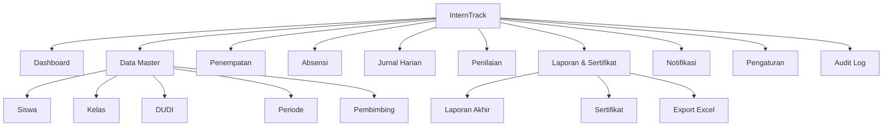

### Navigation Model
- **Sidebar utama** (Admin/Guru/Kepala Sekolah): Dashboard, Data Master (Admin only), Penempatan, Absensi, Jurnal, Penilaian, Laporan, Notifikasi, Pengaturan (Admin only), Audit Log (Admin/Super Admin only)
- **Navigasi Siswa** (lebih ringkas, mobile-first): Home/Absensi, Jurnal Saya, Nilai & Progres, Notifikasi
- **Navigasi Pembimbing Industri** (paling ringkas): Siswa Bimbingan, Jurnal, Penilaian

### User Flows (Mermaid)

**Login**
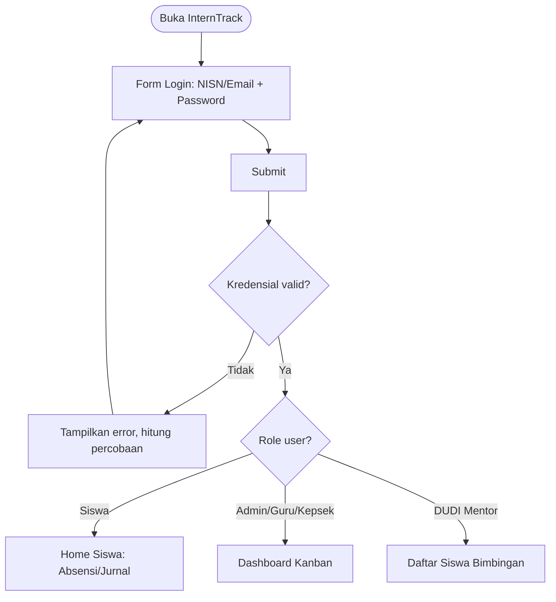

**Absensi QR**
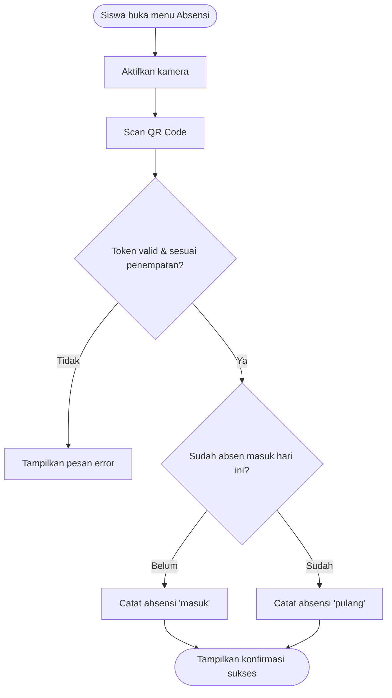

**Jurnal Harian (Submit + Review)**
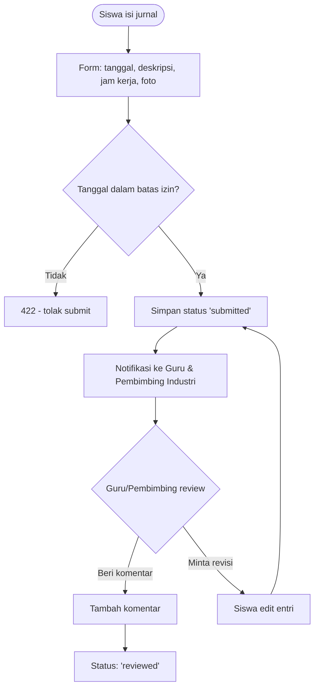

**Penempatan PKL**
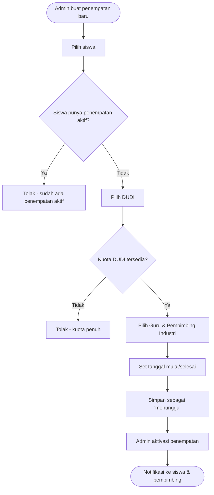

**Penilaian**
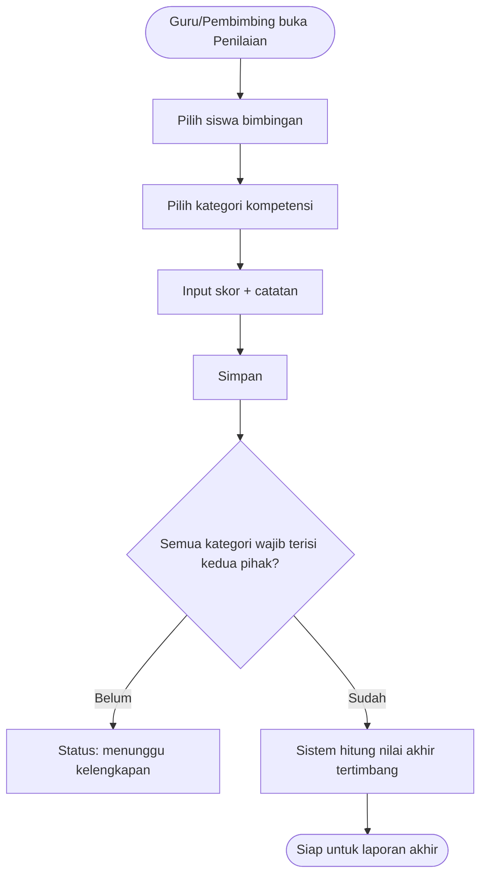

**Laporan Akhir & Sertifikat**
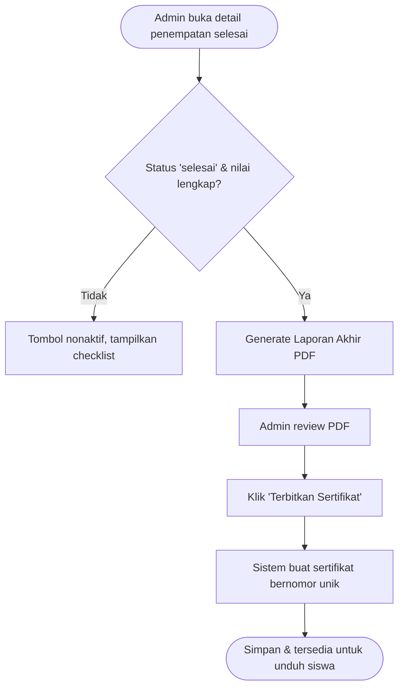

### Task Flow: Approval Chain (Penilaian → Laporan → Sertifikat)
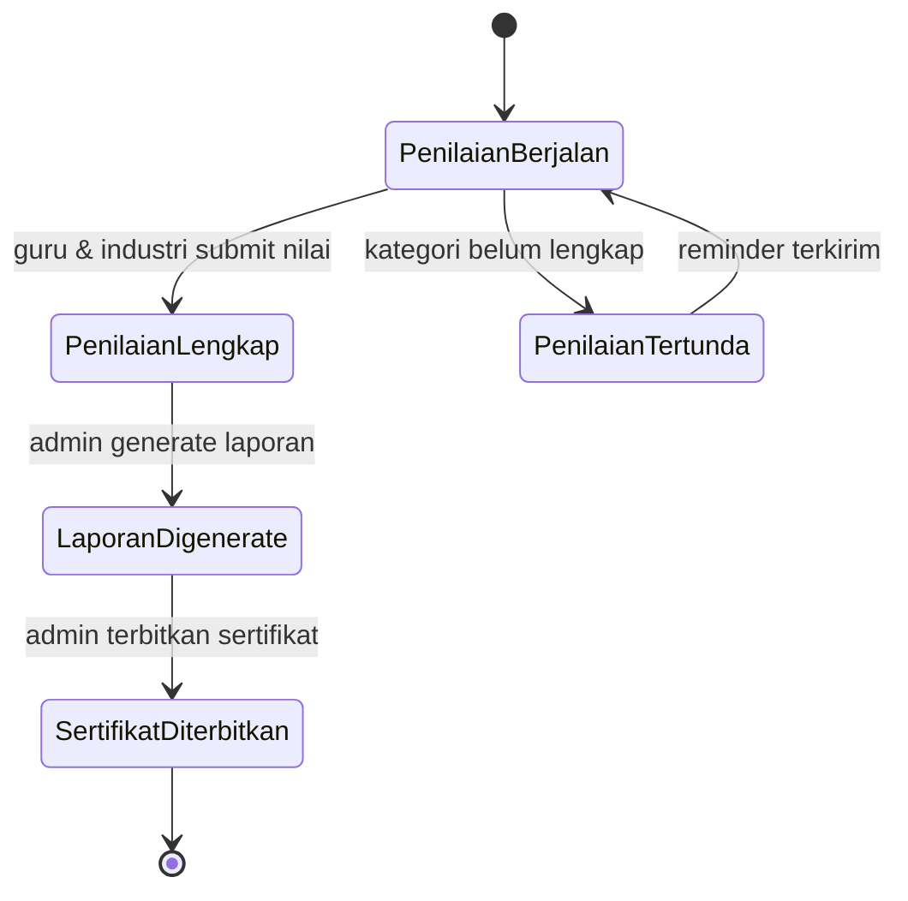

---

## 06. UI

### Design System (diadaptasi dari DSA Apple + pola dashboard referensi)

Dashboard InternTrack mengadopsi disiplin desain Apple (satu warna aksen, tipografi ketat, radius grammar konsisten, shadow yang hemat) tetapi disesuaikan untuk kebutuhan **dashboard data-heavy** (bukan halaman marketing produk).

**Warna** (`{colors.*}` dari DSA Apple, dipetakan ke konteks dashboard):

| Token | Nilai | Penggunaan di InternTrack |
|---|---|---|
| `primary` | #0066cc (Action Blue) | Satu-satunya warna aksen: link, tombol primary, indikator terpilih |
| `ink` | #1d1d1f | Teks utama |
| `ink-muted-80` | #333333 | Teks sekunder |
| `ink-muted-48` | #7a7a7a | Placeholder, caption |
| `canvas` | #ffffff | Background card |
| `canvas-parchment` | #f5f5f7 | Background halaman/sidebar |
| `surface-pearl` | #fafafc | Background elemen sekunder |
| `hairline` | #e0e0e0 | Border card (pengganti shadow default) |
| `surface-black` | #000000 | Kartu "highlight" status (mis. kartu tahap kanban yang sedang aktif — meniru kartu hitam "Request Processing" pada referensi) |
| Status tambahan (di luar DSA, perlu untuk data status) | Hijau `#1a7f37` (Selesai/Valid), Merah `#d92d20` (Bermasalah/Anomali), Kuning `#dc6803` (Menunggu) | **ASSUMPTION** — DSA Apple murni satu-aksen, tapi dashboard butuh warna status semantik minimal; dibatasi hanya untuk badge/indicator, bukan elemen interaktif baru |

**Tipografi** — dipetakan ke skala dashboard yang lebih ringkas dari skala marketing Apple:

| Token DSA | Digunakan untuk |
|---|---|
| `display-md` (34px/600) | Judul halaman (mis. "Dashboard", "Data Siswa") |
| `tagline` (21px/600) | Judul section/card |
| `body-strong` (17px/600) | Label penting, nama entitas di tabel |
| `body` (17px/400/1.47) | Teks body umum, isi form |
| `caption` (14px/400) | Meta info, timestamp |
| `caption-strong` (14px/600) | Label kolom tabel |
| `fine-print` (12px/400) | Footnote, disclaimer |

Weight ladder tetap 300/400/600 (tanpa 500), sesuai aturan DSA.

**Radius grammar** (`{rounded.*}`): `pill` untuk semua tombol CTA & chip status, `lg` (18px) untuk card utility (mengikuti `store-utility-card`), `sm` (8px) untuk elemen compact (avatar badge, ikon button), `none` khusus untuk full-bleed banner jika ada.

**Spacing:** skala 4/8/12/17/24/32/48/80px dipakai konsisten; card padding standar 24px (`spacing.lg`), gap antar card 24px.

**Shadow:** DSA Apple membatasi shadow hanya untuk foto produk. Di dashboard, prinsip ini diterjemahkan: **card default TIDAK pakai shadow** — pakai `1px solid {hairline}` sebagai pembeda (seperti `store-utility-card`), shadow halus hanya dipakai pada elemen benar-benar mengambang (dropdown, modal, floating action button) — meniru penggunaan shadow yang "hemat" pada DSA.

**Kartu highlight hitam** — pola dari referensi visual (kartu "Request Processing" berlatar hitam solid, rounded, dengan panah) diadopsi sebagai **kartu status tahap aktif** pada dashboard kanban: latar `{colors.surface-black}`, teks putih, rounded `lg`, dipakai untuk menyorot tahap PKL yang perlu perhatian saat ini.

### Wireframe Specification (struktur per layar kunci)

**1. Login**
Card terpusat (max-width 400px) di atas `canvas-parchment`: logo sekolah, field NISN/Email, field Password, tombol primary "Masuk" (pill), link "Lupa password?".

**2. Dashboard (Admin/Guru/Kepala Sekolah)** — mengikuti pola referensi visual persis:
- Header: judul halaman + avatar stack pengguna terkait (siswa/pembimbing yang perlu perhatian) dengan badge angka
- Baris kanban 3–4 kolom card putih (`store-utility-card` style): "Pendaftaran & Pembekalan", "Pelaksanaan PKL", "Penilaian", "Selesai/Sertifikasi" — tiap kolom berisi daftar item ringkas (nama siswa + status icon)
- Kartu highlight hitam di sisi kanan atas menyorot tahap yang sedang aktif/butuh aksi
- Section bawah: 2 kartu statistik donut chart (Aktif vs Selesai vs Bermasalah) + tabel ringkasan aktivitas terbaru dengan filter tanggal & pencarian

**3. Data Master (Siswa/DUDI/Kelas/Periode)** — layout tabel standar: search bar + filter di atas, tabel data (`caption-strong` untuk header kolom), tombol "+" pill di kanan atas untuk tambah data, row actions (edit/hapus) di kolom terakhir.

**4. Detail Penempatan** — layout 2 kolom: kiri = info siswa & DUDI (foto, kontak, tanggal), kanan = tab (Absensi | Jurnal | Penilaian | Laporan) dengan konten sesuai tab aktif.

**5. Home Siswa (mobile-first)** — layout single-column: tombol besar "Scan Absensi" (kamera full-width), status absensi hari ini, shortcut "Isi Jurnal Hari Ini", ringkasan progres (jumlah hari hadir, nilai sementara jika sudah ada).

**6. Form Jurnal Harian** — form vertikal sederhana: date picker (default hari ini, dibatasi rentang izin), textarea deskripsi, input jam kerja, upload foto (opsional, max 5MB), tombol submit pill full-width (mobile).

**7. Form Penilaian** — daftar kategori kompetensi sebagai accordion/list, tiap kategori punya input skor (slider atau angka) + textarea catatan, indikator progres "3 dari 5 kategori terisi".

**8. Laporan & Sertifikat** — daftar penempatan `selesai` dengan status kelengkapan (checklist visual), tombol "Generate Laporan" dan "Terbitkan Sertifikat" muncul aktif hanya jika syarat terpenuhi, preview PDF inline.

**9. Notifikasi** — dropdown dari ikon lonceng di header (pola referensi: ikon bulat kecil di kanan atas) + halaman penuh daftar notifikasi dengan status baca/belum.

**10. Pengaturan** — tab: Profil Sekolah, Tahun Ajaran, Kategori Penilaian, Template Sertifikat.

### Component Inventory

| Komponen | Varian |
|---|---|
| Button | primary (pill, biru), secondary (pill, outline), icon-circular (44×44, untuk aksi cepat: +, share, calendar — sesuai referensi) |
| Card | utility-card (hairline border, rounded-lg), highlight-card (hitam solid, untuk status aktif) |
| Avatar & Avatar Stack | dengan badge angka notifikasi (pola dari referensi) |
| Table | header sticky, sortable, dengan pagination |
| Badge/Status Pill | Aktif (hijau), Menunggu (kuning), Bermasalah/Anomali (merah), Selesai (biru) |
| Donut Chart | statistik ringkas dengan label tengah (pola dari referensi "Executed"/"Active") |
| Form Input | text, textarea, date picker, file upload, select |
| QR Scanner | modal/full-screen kamera view dengan overlay target scan |
| Modal/Dialog | konfirmasi aksi (koreksi absensi, terbitkan sertifikat) |
| Notification Dropdown | ikon lonceng + list preview |
| Sidebar Navigation | collapsible, ikon + label |
| Breadcrumb | untuk halaman detail bertingkat |

### Responsive Behavior

| Breakpoint | Perilaku |
|---|---|
| ≥ 1024px (Desktop) | Sidebar penuh terbuka, dashboard kanban 3–4 kolom sejajar |
| 768–1023px (Tablet) | Sidebar collapse ke ikon saja, kanban 2 kolom + scroll horizontal untuk sisanya |
| < 768px (Mobile — terutama untuk Siswa) | Sidebar jadi bottom navigation atau hamburger, kanban jadi stack vertikal per tahap, tabel jadi card list, kamera QR full-screen native |

Touch target minimum 44×44px dipertahankan di semua breakpoint (mengikuti standar DSA Apple).

---

## 07. Architecture

### System Architecture Diagram
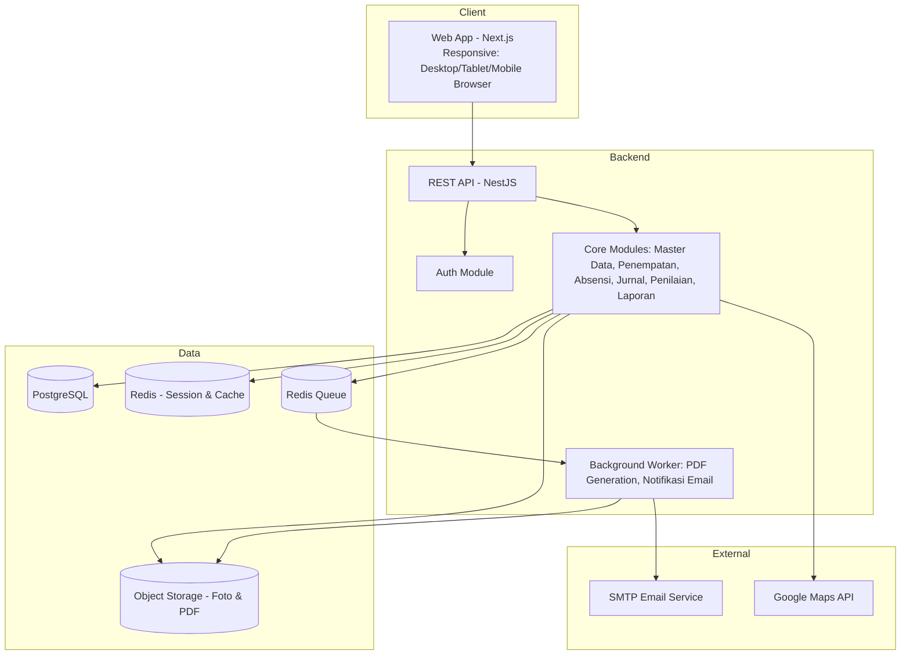

### Service Boundaries
**Modular monolith** (bukan microservices) — dipilih karena skala single-sekolah (§NFR-004/005) tidak membutuhkan kompleksitas operasional microservices. Modul dipisah secara logis (controller → service → repository per domain: Auth, MasterData, Penempatan, Absensi, Jurnal, Penilaian, Laporan, Notifikasi) di dalam satu codebase/deployment unit, sehingga mudah dipecah jadi service terpisah nanti jika skala bertambah (mis. saat ekspansi multi-sekolah — lihat Roadmap).

### API Strategy
REST, JSON, versioned di bawah `/api/v1/`. GraphQL tidak dipilih karena kompleksitas query dashboard di sini relatif flat (bukan graph data yang dalam), dan tim lebih mudah maintain REST + dokumentasi endpoint eksplisit untuk kebutuhan audit.

### Event Flow (Async)
Dua proses dijadikan asynchronous via queue (Redis + worker), karena berpotensi lambat/blocking jika dijalankan sinkron:
1. **Generate PDF** (laporan akhir, sertifikat) — proses rendering PDF bisa memakan beberapa detik; dijalankan sebagai job, hasil di-polling/di-notifikasi ke Admin saat selesai.
2. **Pengiriman notifikasi email** — dikirim via queue agar request utama (mis. submit jurnal) tidak menunggu proses SMTP.

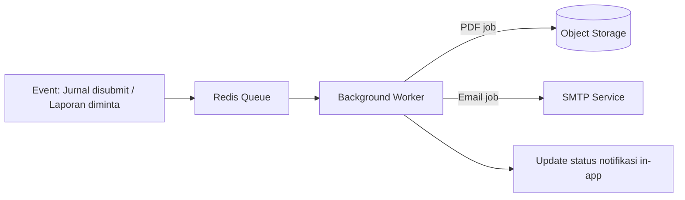

### Caching Strategy
- Redis dipakai untuk: (1) session/token blacklist, (2) cache agregat dashboard (statistik donut chart, hitungan siswa per status) dengan TTL 60 detik agar dashboard tetap ringan meski diakses banyak Admin/Guru bersamaan.
- Cache di-invalidate manual saat ada perubahan status penempatan/absensi/penilaian yang memengaruhi agregat.

### Context Diagram
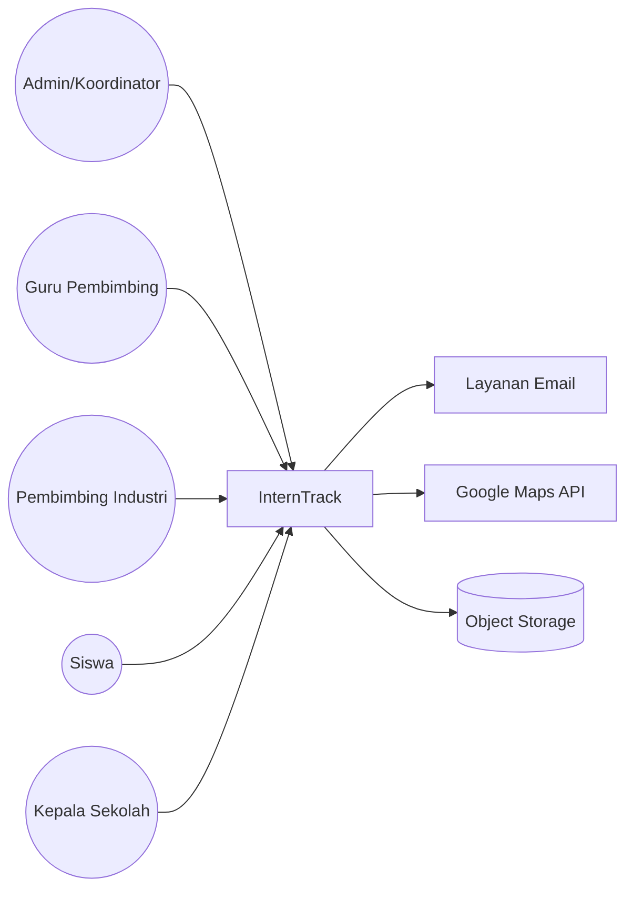

---

## 08. Database

**Naming convention:** snake_case, tabel plural, FK singular (`student_id`). UUID sebagai PK. Soft delete via `deleted_at` untuk semua data user-facing/auditable (siswa, penempatan, jurnal, penilaian, dll); hard delete hanya untuk data transient (mis. token reset password kadaluwarsa).

### ER Diagram
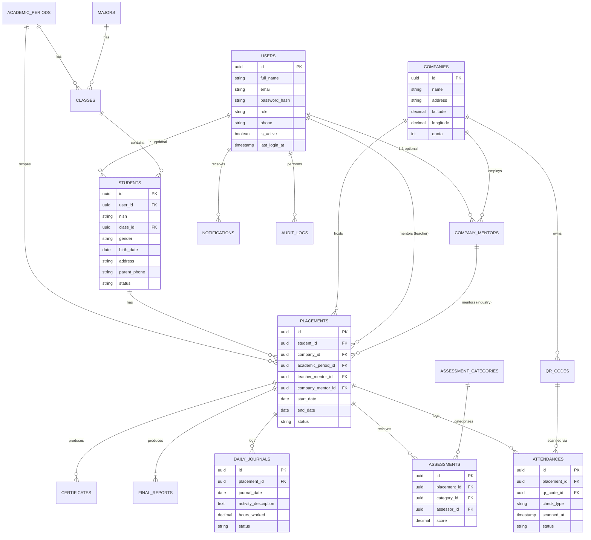

### Table Definitions

#### users
| Column | Type | Constraints | Notes |
|---|---|---|---|
| id | uuid | PK | |
| full_name | varchar(150) | NOT NULL | |
| email | varchar(150) | UNIQUE, nullable | nullable karena siswa login pakai NISN, bukan email wajib |
| nisn_login | varchar(20) | UNIQUE, nullable | dipakai khusus login siswa |
| password_hash | varchar(255) | NOT NULL | |
| role | varchar(30) | NOT NULL, CHECK IN ('super_admin','admin_pkl','guru_pembimbing','pembimbing_industri','siswa','kepala_sekolah') | |
| phone | varchar(20) | nullable | |
| avatar_url | varchar(255) | nullable | |
| is_active | boolean | NOT NULL, default true | |
| last_login_at | timestamptz | nullable | |
| created_at, created_by, updated_at, updated_by, deleted_at | — | standar audit fields | |

Indexes: `idx_users_role (role)`, `idx_users_email (email)`, `idx_users_nisn_login (nisn_login)`

#### school_profile
| Column | Type | Constraints | Notes |
|---|---|---|---|
| id | uuid | PK | singleton — hanya 1 baris aktif |
| school_name | varchar(150) | NOT NULL | |
| npsn | varchar(20) | NOT NULL | |
| address | text | | |
| logo_url | varchar(255) | nullable | |
| active_period_id | uuid | FK -> academic_periods.id, nullable | |
| audit fields | — | | |

#### academic_periods
| Column | Type | Constraints | Notes |
|---|---|---|---|
| id | uuid | PK | |
| name | varchar(50) | NOT NULL | mis. "2026/2027 Ganjil" |
| start_date | date | NOT NULL | |
| end_date | date | NOT NULL | |
| is_active | boolean | NOT NULL, default false | |
| audit fields | — | | |

#### majors
| Column | Type | Constraints |
|---|---|---|
| id | uuid | PK |
| name | varchar(100) | NOT NULL |
| code | varchar(20) | UNIQUE |
| audit fields | — | |

#### classes
| Column | Type | Constraints | Notes |
|---|---|---|---|
| id | uuid | PK | |
| major_id | uuid | FK -> majors.id, NOT NULL | |
| academic_period_id | uuid | FK -> academic_periods.id, NOT NULL | |
| name | varchar(50) | NOT NULL | mis. "XI RPL 1" |
| audit fields | — | | |

Indexes: `idx_classes_major_id`, `idx_classes_period_id`

#### students
| Column | Type | Constraints | Notes |
|---|---|---|---|
| id | uuid | PK | |
| user_id | uuid | FK -> users.id, UNIQUE, nullable | |
| nisn | varchar(20) | UNIQUE, NOT NULL | |
| class_id | uuid | FK -> classes.id, NOT NULL | |
| gender | varchar(10) | | |
| birth_date | date | nullable | |
| address | text | nullable | **field sensitif — dienkripsi at-rest** |
| parent_phone | varchar(20) | nullable | **field sensitif — dienkripsi at-rest** |
| photo_url | varchar(255) | nullable | |
| status | varchar(20) | NOT NULL, CHECK IN ('aktif','selesai','bermasalah','dropped'), default 'aktif' | |
| audit fields | — | | |

Indexes: `idx_students_nisn`, `idx_students_class_id`, `idx_students_status`

#### companies
| Column | Type | Constraints |
|---|---|---|
| id | uuid | PK |
| name | varchar(150) | NOT NULL |
| address | text | |
| latitude | decimal(10,7) | nullable |
| longitude | decimal(10,7) | nullable |
| industry_type | varchar(100) | nullable |
| contact_person | varchar(100) | nullable |
| contact_phone | varchar(20) | nullable |
| quota | int | NOT NULL, default 0 |
| audit fields | — | |

#### company_mentors
| Column | Type | Constraints |
|---|---|---|
| id | uuid | PK |
| company_id | uuid | FK -> companies.id, NOT NULL |
| user_id | uuid | FK -> users.id, UNIQUE, NOT NULL |
| position | varchar(100) | nullable |
| audit fields | — | |

#### placements
| Column | Type | Constraints | Notes |
|---|---|---|---|
| id | uuid | PK | |
| student_id | uuid | FK -> students.id, NOT NULL | |
| company_id | uuid | FK -> companies.id, NOT NULL | |
| academic_period_id | uuid | FK -> academic_periods.id, NOT NULL | |
| teacher_mentor_id | uuid | FK -> users.id, NOT NULL | |
| company_mentor_id | uuid | FK -> company_mentors.id, NOT NULL | |
| start_date | date | NOT NULL | |
| end_date | date | NOT NULL | |
| status | varchar(20) | NOT NULL, CHECK IN ('menunggu','aktif','selesai','dibatalkan'), default 'menunggu' | |
| final_score | decimal(5,2) | nullable | terisi setelah BR-04 terpenuhi |
| audit fields | — | | |

Constraint tambahan: `UNIQUE (student_id, academic_period_id) WHERE status IN ('menunggu','aktif')` — menegakkan BR-01.
Indexes: `idx_placements_student_id`, `idx_placements_company_id`, `idx_placements_status`

#### qr_codes
| Column | Type | Constraints | Notes |
|---|---|---|---|
| id | uuid | PK | |
| company_id | uuid | FK -> companies.id, NOT NULL | |
| code_value | varchar(255) | UNIQUE, NOT NULL | token acak, di-hash |
| version | int | NOT NULL, default 1 | naik setiap regenerasi (BR-08) |
| is_active | boolean | NOT NULL, default true | |
| audit fields | — | | |

#### attendances
| Column | Type | Constraints | Notes |
|---|---|---|---|
| id | uuid | PK | |
| placement_id | uuid | FK -> placements.id, NOT NULL | |
| qr_code_id | uuid | FK -> qr_codes.id, NOT NULL | |
| check_type | varchar(10) | NOT NULL, CHECK IN ('masuk','pulang') | |
| scanned_at | timestamptz | NOT NULL | |
| latitude | decimal(10,7) | nullable | opsional, verifikasi sekunder |
| longitude | decimal(10,7) | nullable | opsional, verifikasi sekunder |
| status | varchar(20) | NOT NULL, CHECK IN ('valid','anomali'), default 'valid' | |
| correction_note | text | nullable | wajib diisi jika dikoreksi manual (BR-07) |
| verified_by | uuid | FK -> users.id, nullable | |
| audit fields | — | | |

Indexes: `idx_attendances_placement_id`, `idx_attendances_status`, `idx_attendances_scanned_at`

#### daily_journals
| Column | Type | Constraints | Notes |
|---|---|---|---|
| id | uuid | PK | |
| placement_id | uuid | FK -> placements.id, NOT NULL | |
| journal_date | date | NOT NULL | |
| activity_description | text | NOT NULL | |
| hours_worked | decimal(4,1) | nullable | |
| photo_url | varchar(255) | nullable | |
| status | varchar(20) | NOT NULL, CHECK IN ('draft','submitted','reviewed'), default 'draft' | |
| teacher_comment | text | nullable | |
| company_comment | text | nullable | |
| reviewed_by_teacher_id | uuid | FK -> users.id, nullable | |
| reviewed_by_company_id | uuid | FK -> company_mentors.id, nullable | |
| audit fields | — | | |

Constraint: `UNIQUE (placement_id, journal_date)` — satu entri per hari per penempatan.
Indexes: `idx_journals_placement_id`, `idx_journals_date`, `idx_journals_status`

#### assessment_categories
| Column | Type | Constraints |
|---|---|---|
| id | uuid | PK |
| name | varchar(100) | NOT NULL |
| max_score | decimal(5,2) | NOT NULL, default 100 |
| weight | decimal(5,2) | NOT NULL |
| assessor_type | varchar(20) | NOT NULL, CHECK IN ('sekolah','industri','both') |
| audit fields | — | |

#### assessments
| Column | Type | Constraints |
|---|---|---|
| id | uuid | PK |
| placement_id | uuid | FK -> placements.id, NOT NULL |
| category_id | uuid | FK -> assessment_categories.id, NOT NULL |
| assessor_id | uuid | FK -> users.id, NOT NULL |
| score | decimal(5,2) | NOT NULL |
| notes | text | nullable |
| audit fields | — | |

Constraint: `UNIQUE (placement_id, category_id, assessor_id)`

#### final_reports
| Column | Type | Constraints |
|---|---|---|
| id | uuid | PK |
| placement_id | uuid | FK -> placements.id, UNIQUE, NOT NULL |
| summary | text | nullable |
| pdf_url | varchar(255) | NOT NULL |
| generated_at | timestamptz | NOT NULL |
| generated_by | uuid | FK -> users.id, NOT NULL |
| audit fields | — | |

#### certificates
| Column | Type | Constraints |
|---|---|---|
| id | uuid | PK |
| placement_id | uuid | FK -> placements.id, UNIQUE, NOT NULL |
| certificate_number | varchar(50) | UNIQUE, NOT NULL |
| issued_date | date | NOT NULL |
| pdf_url | varchar(255) | NOT NULL |
| issued_by | uuid | FK -> users.id, NOT NULL |
| audit fields | — | |

#### notifications
| Column | Type | Constraints |
|---|---|---|
| id | uuid | PK |
| user_id | uuid | FK -> users.id, NOT NULL |
| type | varchar(50) | NOT NULL |
| title | varchar(150) | NOT NULL |
| message | text | NOT NULL |
| is_read | boolean | NOT NULL, default false |
| related_entity_type | varchar(50) | nullable |
| related_entity_id | uuid | nullable |
| created_at | timestamptz | NOT NULL, default now() |

Indexes: `idx_notifications_user_id`, `idx_notifications_is_read`

#### audit_logs
| Column | Type | Constraints |
|---|---|---|
| id | uuid | PK |
| user_id | uuid | FK -> users.id, nullable |
| action | varchar(100) | NOT NULL |
| entity_type | varchar(50) | NOT NULL |
| entity_id | uuid | nullable |
| old_value | jsonb | nullable |
| new_value | jsonb | nullable |
| ip_address | varchar(45) | nullable |
| created_at | timestamptz | NOT NULL, default now() |

Indexes: `idx_audit_logs_entity (entity_type, entity_id)`, `idx_audit_logs_user_id`, `idx_audit_logs_created_at` — retensi 1 tahun (NFR-011), partisi bulanan **ASSUMPTION** untuk menjaga performa jika volume besar.

---

## 09. API

Konvensi: REST, JSON, versioned `/api/v1/`. Auth via Bearer JWT. Error envelope standar:
```json
{
  "error": {
    "code": "VALIDATION_ERROR",
    "message": "human readable summary",
    "details": [{ "field": "score", "issue": "must be <= max_score" }]
  }
}
```

### Endpoint Table per Modul

**Auth**
| Method | Path | Permission |
|---|---|---|
| POST | /api/v1/auth/login | public |
| POST | /api/v1/auth/logout | authenticated |
| POST | /api/v1/auth/forgot-password | public |
| POST | /api/v1/auth/reset-password | public (token-based) |
| POST | /api/v1/auth/refresh | authenticated (refresh token) |

**Master Data**
| Method | Path | Permission |
|---|---|---|
| GET/POST | /api/v1/students | `students:read` / `students:create` |
| GET/PUT/DELETE | /api/v1/students/:id | `students:read/update/delete` |
| GET/POST | /api/v1/companies | `companies:read/create` |
| GET/PUT/DELETE | /api/v1/companies/:id | `companies:read/update/delete` |
| GET/POST | /api/v1/classes | `classes:read/create` |
| GET/POST | /api/v1/academic-periods | `periods:read/create` |
| POST | /api/v1/users/invite | `users:invite` (guru/DUDI mentor) |

**Penempatan**
| Method | Path | Permission |
|---|---|---|
| GET/POST | /api/v1/placements | `placements:read/create` |
| GET/PUT | /api/v1/placements/:id | `placements:read/update` |
| POST | /api/v1/placements/:id/activate | `placements:update` |
| POST | /api/v1/placements/:id/complete | `placements:update` |

**Absensi**
| Method | Path | Permission |
|---|---|---|
| POST | /api/v1/attendances/scan | `attendances:create` (siswa) |
| GET | /api/v1/attendances?placement_id= | `attendances:read` |
| POST | /api/v1/attendances/:id/correct | `attendances:correct` (Admin/Guru) |
| POST | /api/v1/companies/:id/qr-code/regenerate | `qr:regenerate` (Admin) |

**Jurnal**
| Method | Path | Permission |
|---|---|---|
| GET/POST | /api/v1/journals | `journals:read/create` |
| PUT | /api/v1/journals/:id | `journals:update` (siswa, sebelum reviewed) |
| POST | /api/v1/journals/:id/review | `journals:review` (guru/pembimbing industri) |

**Penilaian**
| Method | Path | Permission |
|---|---|---|
| GET/POST | /api/v1/assessment-categories | `assessment-categories:read/create` (Admin) |
| GET/POST | /api/v1/assessments | `assessments:read/create` (guru/pembimbing industri) |

**Laporan**
| Method | Path | Permission |
|---|---|---|
| POST | /api/v1/placements/:id/final-report | `reports:generate` (Admin) |
| POST | /api/v1/placements/:id/certificate | `certificates:issue` (Admin) |
| GET | /api/v1/export/students.xlsx | `export:read` (Admin) |

**Dashboard & Notifikasi**
| Method | Path | Permission |
|---|---|---|
| GET | /api/v1/dashboard/summary | `dashboard:read` |
| GET | /api/v1/notifications | `notifications:read` |
| POST | /api/v1/notifications/:id/read | `notifications:update` |

### Detail Endpoint (representatif)

#### POST /api/v1/attendances/scan
**Auth:** Bearer token required (role: siswa). **Permission:** `attendances:create`

**Request body:**
```json
{
  "qr_code_value": "string, required",
  "latitude": "number, optional",
  "longitude": "number, optional"
}
```

**Response 201:**
```json
{
  "id": "uuid",
  "check_type": "masuk",
  "scanned_at": "2026-07-21T08:03:00+07:00",
  "status": "valid"
}
```

**Validasi:** `qr_code_value` harus cocok dengan QR aktif milik DUDI tempat siswa punya penempatan `aktif`; jika siswa sudah absen "masuk" hari ini, request berikutnya otomatis dicatat sebagai "pulang".

**Errors:**
| Code | Meaning |
|---|---|
| 400 | Payload tidak valid |
| 401 | Belum login |
| 403 | Bukan role siswa, atau QR bukan milik DUDI penempatan aktif siswa |
| 404 | QR Code tidak ditemukan/tidak aktif |
| 422 | Siswa tidak memiliki penempatan aktif pada tanggal ini |

#### POST /api/v1/journals
**Auth:** Bearer token required (role: siswa). **Permission:** `journals:create`

**Request body:**
```json
{
  "placement_id": "uuid, required",
  "journal_date": "date, required, format YYYY-MM-DD",
  "activity_description": "string, required, max 2000 chars",
  "hours_worked": "number, optional, >= 0 and <= 24",
  "photo_url": "string, optional"
}
```

**Response 201:**
```json
{
  "id": "uuid",
  "status": "submitted",
  "created_at": "ISO 8601"
}
```

**Errors:**
| Code | Meaning |
|---|---|
| 422 | `journal_date` di luar rentang izin (BR-06) atau entri untuk tanggal tsb sudah ada |
| 403 | `placement_id` bukan milik siswa yang login |

#### POST /api/v1/assessments
**Auth:** Bearer token required (role: guru_pembimbing atau pembimbing_industri). **Permission:** `assessments:create`

**Request body:**
```json
{
  "placement_id": "uuid, required",
  "category_id": "uuid, required",
  "score": "number, required, 0 <= score <= category.max_score",
  "notes": "string, optional"
}
```

**Response 201:**
```json
{
  "id": "uuid",
  "score": 88,
  "final_score_calculated": false
}
```

`final_score_calculated` bernilai `true` jika input ini melengkapi seluruh kategori wajib (BR-04), memicu perhitungan `placements.final_score`.

**Errors:**
| Code | Meaning |
|---|---|
| 403 | Assessor bukan pembimbing yang ditugaskan pada penempatan ini |
| 422 | `score` melebihi `max_score` kategori |

#### POST /api/v1/placements/:id/certificate
**Auth:** Bearer token required (role: admin_pkl atau super_admin). **Permission:** `certificates:issue`

**Response 201:**
```json
{
  "id": "uuid",
  "certificate_number": "SERT/2026/0001",
  "pdf_url": "https://.../certificates/uuid.pdf",
  "issued_date": "2026-07-21"
}
```

**Errors:**
| Code | Meaning |
|---|---|
| 422 | Penempatan belum berstatus `selesai`, atau `final_score` belum terisi (BR-05) |
| 409 | Sertifikat untuk penempatan ini sudah pernah diterbitkan |

---

## 10. Security

### Threat Model Summary
Sistem menyimpan data pribadi siswa (sebagian di bawah umur), termasuk kontak orang tua dan foto — aset utama yang dilindungi. Ancaman relevan: (1) akses tidak sah ke data siswa oleh pihak eksternal (mis. akun pembimbing industri disalahgunakan), (2) pemalsuan/replay QR Code absensi, (3) eskalasi hak akses antar role.

### RBAC Permission Matrix

| Role | Master Data | Penempatan | Absensi | Jurnal | Penilaian | Laporan/Sertifikat | Pengaturan | Audit Log |
|---|---|---|---|---|---|---|---|---|
| Super Admin | CRUD | CRUD | CRUD | CRUD | CRUD | CRUD | CRUD | Read |
| Admin/Koordinator PKL | CRUD | CRUD | Read, Correct | Read | Read | CRUD | CRUD | Read |
| Guru Pembimbing | Read (siswa bimbingan) | Read | Read, Correct (bimbingan) | Read, Review | Create/Update (bimbingan) | Read | — | — |
| Pembimbing Industri | Read (siswa bimbingan) | Read | Read (bimbingan) | Read, Review | Create/Update (bimbingan) | Read | — | — |
| Siswa | Read (diri sendiri) | Read (diri sendiri) | Create (scan) | Create/Update (draft) | Read (diri sendiri) | Read (diri sendiri) | — | — |
| Kepala Sekolah | Read | Read | Read | Read | Read | Read | — | — |

### Encryption
- **In transit:** TLS 1.2 minimum (rekomendasi 1.3) untuk seluruh koneksi client-server.
- **At rest:** Enkripsi database-level (mis. PostgreSQL `pgcrypto` atau disk-level encryption pada managed DB) untuk seluruh database; field spesifik sensitif (`students.address`, `students.parent_phone`) ditambah enkripsi kolom (application-level) sebagai lapisan kedua.
- Foto (jurnal, avatar) disimpan di object storage privat, diakses via signed URL berumur pendek (bukan URL publik permanen).

### Token/Session Strategy
- Access token JWT, masa berlaku 15 menit.
- Refresh token, masa berlaku 7 hari, disimpan sebagai httpOnly secure cookie (bukan localStorage) untuk mitigasi XSS.
- Logout/blacklist token disimpan di Redis hingga expiry alami token.

### Rate Limiting
- Login: 5 percobaan / 15 menit per akun & per IP.
- Reset password: 3 permintaan / jam per akun.
- Endpoint export data: 10 request / jam per user (mencegah scraping data siswa massal).

### Audit Trail
Aksi yang dicatat (NFR-011, FR-031): login/logout, perubahan data siswa, koreksi absensi manual, regenerasi QR Code, penerbitan sertifikat, export data. Disimpan `old_value`/`new_value` dalam JSONB, retensi minimal 1 tahun.

### OWASP Considerations (relevan untuk permukaan serangan InternTrack)
- **Broken Access Control (A01):** mitigasi via RBAC matrix di atas + pengecekan kepemilikan resource (mis. guru hanya bisa akses siswa bimbingannya sendiri, dicek di service layer bukan hanya UI).
- **Cryptographic Failures (A02):** enkripsi field sensitif + TLS, lihat di atas.
- **Injection (A03):** ORM dengan parameterized query (tidak ada raw SQL string concatenation).
- **Identification & Authentication Failures (A07):** rate limiting login, password hashing dengan bcrypt/argon2, token refresh strategy di atas.
- **Server-Side Request Forgery / QR Token Forgery (custom untuk domain ini):** QR token acak panjang (bukan tebakan/incremental ID), validasi server-side terhadap penempatan aktif, rotasi via regenerasi manual (BR-08).

---

## 11. QA

### Test Strategy
- **Unit test:** logic bisnis kritikal — perhitungan nilai akhir tertimbang, validasi rentang tanggal jurnal, validasi kepemilikan QR Code.
- **Integration test:** endpoint API terhadap database test (mis. skenario penempatan duplikat, koreksi absensi).
- **E2E test:** flow utama end-to-end (login → penempatan → absensi → jurnal → penilaian → laporan) menggunakan Playwright.
- **Manual/UAT:** dengan stakeholder riil (Koordinator PKL, 1 guru, 1 siswa) sebelum go-live.

### Smoke Test Checklist (dijalankan tiap deploy)
- [ ] Login berhasil untuk masing-masing role
- [ ] Dashboard tampil tanpa error untuk Admin
- [ ] Siswa dapat scan QR dan tercatat sebagai absensi valid
- [ ] Siswa dapat submit jurnal harian
- [ ] Guru dapat submit penilaian
- [ ] Admin dapat generate laporan akhir untuk penempatan yang syaratnya terpenuhi

### Regression Checklist
- [ ] Constraint BR-01 (satu penempatan aktif per siswa) tetap tertegakkan setelah perubahan skema
- [ ] QR lama tidak valid lagi setelah regenerasi (BR-08)
- [ ] Notifikasi jurnal H+1 tetap terkirim setelah perubahan modul notifikasi
- [ ] Export Excel tetap menghasilkan format kolom yang benar

### UAT Scenarios (terhubung ke Acceptance Criteria §04)
1. Koordinator PKL membuat penempatan baru end-to-end dan memverifikasi siswa menerima notifikasi.
2. Siswa menjalani 1 hari simulasi: scan masuk, isi jurnal, scan pulang — verifikasi seluruh data tercatat benar di dashboard Admin.
3. Guru & pembimbing industri menginput seluruh kategori penilaian — verifikasi nilai akhir terhitung otomatis dan benar.
4. Admin menerbitkan sertifikat — verifikasi PDF berisi data yang benar dan nomor sertifikat unik.

### Test Case Matrix (contoh representatif)

| Feature | Case Type | Scenario | Expected Result |
|---|---|---|---|
| Scan Absensi | Happy path | QR valid, penempatan aktif | 201, status `valid` |
| Scan Absensi | Edge | Scan QR yang sama 2x dalam < 1 menit | Ditolak/duplikat terdeteksi |
| Scan Absensi | Negative | QR milik DUDI lain | 403 |
| Submit Jurnal | Happy path | Tanggal hari ini, deskripsi valid | 201, status `submitted` |
| Submit Jurnal | Edge | Tanggal 4 hari lalu (batas 3 hari) | 422 |
| Submit Jurnal | Negative | Tanpa token auth | 401 |
| Input Penilaian | Happy path | Skor dalam rentang max_score | 201 |
| Input Penilaian | Edge | Skor = max_score persis | 201 |
| Input Penilaian | Negative | Skor melebihi max_score | 422 |
| Terbitkan Sertifikat | Happy path | Status selesai + nilai lengkap | 201, nomor sertifikat unik |
| Terbitkan Sertifikat | Negative | Status belum selesai | 422 |
| Terbitkan Sertifikat | Negative | Sertifikat sudah pernah terbit | 409 |

---

## 12. Deployment

### Environments
| Environment | Tujuan | Data |
|---|---|---|
| Development | Development harian, dapat di-reset | Data dummy/seed |
| Staging | UAT stakeholder sebelum rilis | Data mirip produksi (anonymized) |
| Production | Sistem live | Data riil sekolah |

### CI/CD Flow
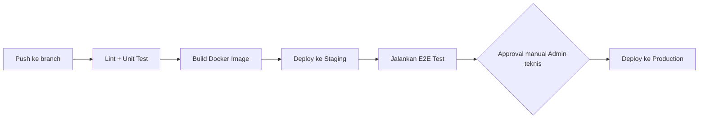

### Infrastructure Summary
Mengingat skala single-sekolah (§NFR), InternTrack **tidak** memerlukan Kubernetes. Rekomendasi: containerized deployment (Docker) pada 1–2 VM/managed compute instance di belakang load balancer terkelola, dengan PostgreSQL sebagai managed database service (bukan self-hosted) untuk mengurangi beban operasional tim sekolah yang kemungkinan tidak punya DBA dedicated. **ASSUMPTION** — dapat dipertimbangkan ulang jika ekspansi multi-sekolah terjadi (lihat Roadmap).

### Monitoring/Alerting
- Error tracking (mis. Sentry) untuk exception backend & frontend.
- Uptime monitoring eksternal dengan alert (email/Slack ke tim teknis) jika downtime > 5 menit.
- Log agregasi terpusat untuk request API (untuk audit performa & debugging).

### Rollback Strategy
Versioned Docker image tags per rilis; rollback = redeploy tag versi sebelumnya. Database migration ditulis reversible (up/down script) agar tidak memerlukan restore penuh untuk rollback kecil.

### Backup & Disaster Recovery
Backup database otomatis harian (full dump), retensi 30 hari, disimpan terpisah dari server utama (object storage berbeda region jika memungkinkan). Target **RPO 24 jam, RTO 4 jam** (NFR-010) — cukup untuk sistem non-mission-critical-finansial seperti ini, namun tetap penting karena berisi data akademik.

---

## 13. Tech Stack

| Layer | Pilihan | Alasan (terkait konteks produk ini) | Alternatif dipertimbangkan |
|---|---|---|---|
| Frontend | Next.js (React) + Tailwind CSS | Web-only responsive (sesuai jawaban discovery), SSR membantu waktu muat awal dashboard (NFR-001), Tailwind memudahkan implementasi design token DSA Apple (spacing/radius/warna) secara konsisten | Vue/Nuxt — valid, tidak dipilih karena ekosistem komponen dashboard (chart, QR scanner) lebih matang di React |
| State Management | TanStack Query (server state) + Zustand (UI state ringan) | Dashboard didominasi data server (siswa, penempatan, dsb) — TanStack Query menyederhanakan caching & refetch; Zustand cukup untuk state UI lokal (mis. modal terbuka), tidak perlu Redux untuk aplikasi seukuran ini | Redux Toolkit — over-engineered untuk skala single-sekolah |
| QR Scanning | `html5-qrcode` (library JS berbasis browser camera API) | Memenuhi keputusan platform "Web saja" — scan QR tetap bisa dilakukan dari kamera browser mobile tanpa app native | ZXing — alternatif setara, `html5-qrcode` dipilih karena API lebih sederhana untuk kasus single-camera scan |
| Backend | NestJS (Node.js/TypeScript) | Struktur modular (module/controller/service) cocok dengan pembagian domain (§07 Service Boundaries), TypeScript sama dengan frontend memudahkan sharing tipe data (DTO) | Laravel (PHP) — umum dipakai vendor sekolah lokal, tidak dipilih agar tipe data konsisten end-to-end dengan frontend TypeScript |
| Database | PostgreSQL | Data sangat relasional (siswa-kelas-penempatan-DUDI-penilaian) dengan kebutuhan constraint kuat (BR-01, BR-04) — cocok untuk RDBMS | MySQL — viable, PostgreSQL dipilih untuk dukungan JSONB (audit log) & constraint check yang lebih ekspresif |
| Cache/Queue | Redis (cache + BullMQ untuk queue) | Kebutuhan cache dashboard ringan (§07 Caching) dan job async PDF/email (§07 Event Flow) — Redis + BullMQ terintegrasi baik dengan Node.js | RabbitMQ — lebih berat untuk kebutuhan queue sederhana ini |
| Object Storage | S3-compatible storage (mis. AWS S3 atau MinIO on-prem) | Menyimpan foto jurnal & PDF laporan/sertifikat dengan signed URL untuk keamanan (§10 Encryption) | Penyimpanan lokal di server — tidak dipilih karena tidak scalable dan berisiko hilang saat redeploy |
| PDF Generation | Puppeteer (render HTML→PDF) dijalankan di background worker | Template laporan/sertifikat dapat didesain sebagai HTML/CSS (memudahkan styling sesuai DSA Apple), dirender async agar tidak blocking request (§07) | PDFKit — lebih ringan tapi styling kompleks (logo, tanda tangan) lebih sulit dibanding HTML-to-PDF |
| Email | SMTP (rekomendasi: Google Workspace for Education yang umum dipakai sekolah) | Sekolah kemungkinan sudah punya akun Google Workspace for Education — memanfaatkan infra yang sudah ada, minim biaya tambahan | Layanan transactional email (SendGrid/Postmark) — lebih andal untuk skala besar, dipertimbangkan sebagai upgrade jika volume notifikasi meningkat |
| Maps | Google Maps JavaScript API | Dibutuhkan untuk FR-035 (tampilkan lokasi DUDI) | OpenStreetMap/Leaflet — gratis, alternatif jika biaya API Google jadi kendala sekolah |
| Deployment/Infra | Docker + managed compute (1–2 instance) + managed PostgreSQL | Skala kecil (§NFR) tidak butuh Kubernetes; managed DB mengurangi beban operasional tim sekolah tanpa DBA dedicated | Kubernetes — dipertimbangkan hanya jika roadmap multi-sekolah/SaaS terealisasi |
| Monitoring | Sentry (error tracking) + uptime monitor eksternal | Kebutuhan dasar untuk mendeteksi bug produksi & downtime tanpa biaya/kompleksitas observability enterprise penuh | Datadog/New Relic — lebih powerful, dipertimbangkan jika skala bertambah signifikan |

---

## 14. Roadmap

| Fase | Tema | Fitur |
|---|---|---|
| MVP (Fase 1) | Digitalisasi inti proses PKL | Seluruh modul in-scope §03: master data, penempatan, absensi QR, jurnal, penilaian, laporan/sertifikat, dashboard, notifikasi email |
| Fase 2 | Perluasan integrasi & pengalaman | Integrasi WhatsApp Business API untuk notifikasi, integrasi Dapodik (import data siswa otomatis), dark mode, PWA offline-first untuk form jurnal di lokasi sinyal lemah |
| Fase 3 | Ekspansi & kecerdasan | Aplikasi mobile native (Android/iOS) untuk siswa, arsitektur multi-tenant untuk mendukung multi-sekolah/dijual sebagai SaaS, analitik prediktif (deteksi dini siswa berisiko bermasalah berdasarkan pola absensi/jurnal) |

---

## Appendix

### Glossary

| Istilah | Arti |
|---|---|
| PKL | Praktik Kerja Lapangan — program magang wajib siswa SMK di dunia industri |
| DUDI | Dunia Usaha/Dunia Industri — perusahaan/instansi mitra tempat siswa PKL |
| NISN | Nomor Induk Siswa Nasional |
| NPSN | Nomor Pokok Sekolah Nasional |
| Pembimbing Industri | Staf DUDI yang membimbing & menilai siswa di lokasi kerja |
| Jurnal Harian | Catatan aktivitas kerja siswa yang diisi setiap hari kerja PKL |

### Open Questions Log

| # | Pertanyaan | Dampak jika tidak dijawab |
|---|---|---|
| Q1 | Apakah sekolah sudah punya Google Workspace for Education (memengaruhi keputusan email SMTP)? | Bila tidak, perlu anggaran layanan email transactional pihak ketiga |
| Q2 | Apakah dibutuhkan integrasi Dapodik di fase mendatang (bukan MVP)? | Memengaruhi prioritas roadmap Fase 2 |
| Q3 | Apakah notifikasi WhatsApp menjadi kebutuhan mendesak (banyak sekolah Indonesia terbiasa pakai WA)? | Bila ya, sebaiknya dinaikkan prioritasnya dari Fase 2 ke MVP+ |
| Q4 | Berapa jumlah siswa PKL aktual per periode di sekolah ini (untuk validasi asumsi skala NFR-004/005)? | Memengaruhi sizing infrastruktur produksi |
| Q5 | Apakah kepala sekolah butuh akses laporan tercetak (bukan hanya digital) untuk keperluan akreditasi/audit dinas? | Memengaruhi kebutuhan fitur export/print tambahan |

### Assumptions Log (konsolidasi)

1. Tujuan bisnis: digitalisasi proses PKL manual (kertas/WA/Excel) menjadi terpusat.
2. Roles: Super Admin, Admin/Koordinator PKL, Guru Pembimbing, Pembimbing Industri, Siswa, Kepala Sekolah (read-only).
3. Modul inti sesuai daftar §03 In-scope.
4. Auth: NISN+password (siswa), email+password (role lain), tanpa SSO.
5. Otorisasi: RBAC statis, bukan permission dinamis.
6. Integrasi MVP: SMTP email, Google Maps, export Excel. Tanpa Dapodik/WhatsApp di MVP.
7. Skala: ~300–600 siswa/periode, ~100 concurrent users, uptime 99.5%.
8. Data pribadi siswa tunduk prinsip UU PDP — perlu enkripsi field sensitif & audit akses.
9. Tidak ada dukungan offline-first penuh di MVP; hanya penyimpanan draft form lokal sebagai mitigasi jaringan lambat.
10. Light mode saja untuk MVP; dark mode masuk roadmap.
11. Timeline MVP diasumsikan ~10 minggu — perlu dikonfirmasi bersama tim implementasi.
12. Warna status semantik (hijau/merah/kuning) ditambahkan di luar palet 1-aksen DSA Apple murni, dibatasi hanya untuk badge/indicator status data — bukan elemen interaktif baru.
13. Skema database dirancang rapi per-modul namun belum dipaksa multi-tenant (`school_id` di semua tabel) karena scope saat ini single-sekolah; migrasi ke multi-tenant diarahkan sebagai pekerjaan arsitektur Fase 3.
14. Infrastruktur direkomendasikan sederhana (1–2 VM + managed DB) tanpa Kubernetes, karena skala saat ini belum membutuhkan orkestrasi kompleks.
